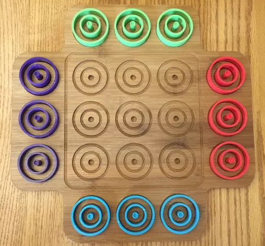

# Project-Rival-Haxe
A HaxeFlixel based project to develop AI players for simple games using a variety of methods  

---

### Installing HaxeFlixel

Steps
1. [Install Haxe](https://haxe.org/download)
2. [Install HaxeFlixel](https://haxeflixel.com/documentation/install-haxeflixel)
3. [Run Hello World](https://haxeflixel.com/documentation/hello-world)

Further instuction can be found of the [Website](https://haxeflixel.com/documentation/getting-started/)

---

# Ortio
The first game that will be added is at game Otrio

### Game Rules
Otrio is a board game that can be played with 2 to 4 players. The objective of the game is to be the first player to line up three pieces of the same color, either in a straight line or in a circular pattern.

To set up the game, each player chooses a color and takes three different-sized circular pieces in their color. The board consists of three concentric circles, each divided into eight spaces. The largest circle is on the outside, followed by the medium and small circles.

To start the game, players take turns placing one piece on the board at a time. Pieces can be placed on any open space on the board, and they can be stacked on top of other pieces as long as they are smaller in size. The goal is to create a line of three pieces of the same color, either in a straight line or in a circular pattern.

Players can also block their opponents by strategically placing their own pieces on the board. If all spaces on the board are filled and no player has lined up three pieces of the same color, the game ends in a tie.

Overall, Otrio is a fun and challenging game that requires strategy and critical thinking to outsmart your opponents and achieve victory.
